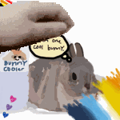

# Slack Autopetter

---
### Example

---

### So what are you exactly?

This is a Slack Bot which automatically tracks updates to your profile picture and will create a pet emoji whenever you change profile picture. So now your pets can always be up to date with no extra effort!

---

### How do I use it?

Join the channel #pfp-petter to consent to your pfp being tracked and then change your profile picture as you would normally on slack. When you change the bot will make the emoji and ping you in the channel with the new pet emoji!

---

### Who tf needs this? 

Well, I made it because a friend wanted me to make new pet emojis for them whenever they changed profile picture (which was a bit too frequently) so I decided to make a bot to automate it.

---

### Credits

Huge thanks to @Devarsh on Slack for making the slack emoji proxy which makes uploading slack emoji's automatically INFINITELY EASIER. Genuine lifesaver.

Also thanks to my friend for the inital suggestion!

---

### Future improvemnts (they won't happen)

The petting is just a shitty pet gif overlay so imporving it to be more lively and animated would be a good next step.  